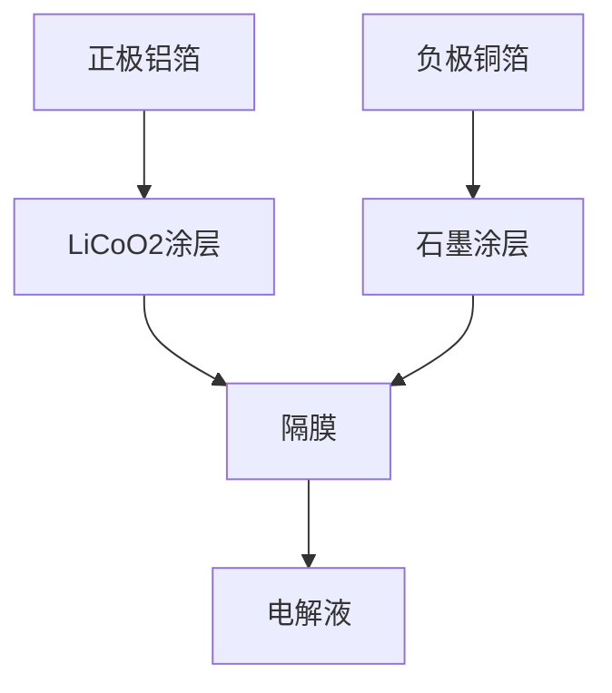
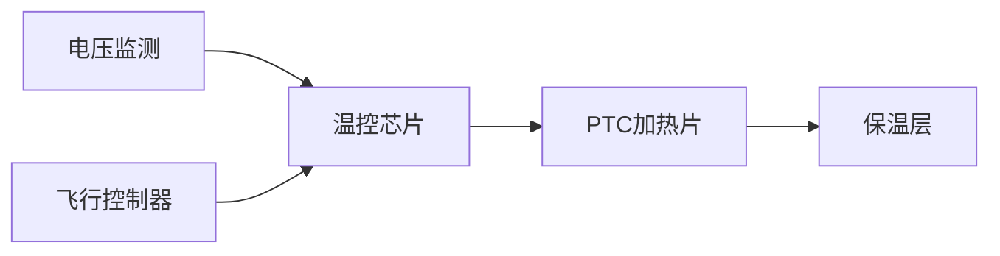
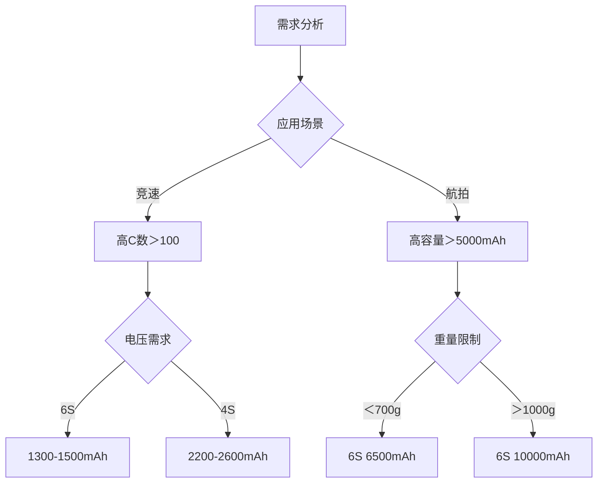

# 无人机电池系统选型与性能优化指南

## 核心参数矩阵（2023 Q3）
### 主流LiPo电池性能对比
| 型号               | 容量(mAh) | 电压(S) | 持续C数 | 重量(g) | 内阻(mΩ) | 能量密度(Wh/kg) |
|--------------------|----------|--------|--------|--------|---------|----------------|
| Tattu R-Line 1300  | 1300     | 6      | 120    | 208    | 1.8     | 215            |
| GNB 3000 18650     | 3000     | 4      | 30     | 450    | 5.2     | 265            |
| CNHL Black 1500    | 1500     | 4      | 100    | 175    | 2.1     | 230            |
| Ovonic 6500        | 6500     | 6      | 50     | 980    | 3.5     | 182            |
| HRB 5000           | 5000     | 4      | 75     | 620    | 4.8     | 198            |

---

## 电池技术深度解析
### 放电性能公式
$$ I_{max} = C_{rating} \times \frac{Capacity}{1000} $$
$$ 飞行时间(min) = \frac{0.7 \times 60 \times Capacity}{I_{avg} \times 1000} $$
- $ I_{max} $: 最大持续电流(A)
- $ I_{avg} $: 平均飞行电流(A)

### 放电曲线分析
```python
import matplotlib.pyplot as plt

voltage = [16.8, 15.6, 14.8, 14.2, 13.5]
capacity = [0, 25, 50, 75, 100]
plt.plot(capacity, voltage)
plt.title('6S LiPo Discharge Curve')
plt.xlabel('Capacity (%)')
plt.ylabel('Voltage (V)')
plt.grid(True)
plt.show()
```

--- 
## 电化学特性
### 电池内部分层结构


### 关键材料参数
| 材料       | 比容量(mAh/g) | 电压平台(V) | 循环寿命 |  
|------------|---------------|-------------|----------|  
| NMC 811    | 200           | 3.7         | 800      |  
| LiCoO2     | 150           | 3.8         | 500      |  
| LiFePO4    | 170           | 3.2         | 2000     |  
| 硅碳复合    | 420           | 0.5-1.2     | 300      |  

--- 
## 安装与维护规范
### 焊接工艺标准
| 参数         | 18650电芯   | LiPo软包     |  
|--------------|-------------|---------------|  
| 烙铁温度     | 380±10℃     | 320±10℃      |  
| 焊接时间     | ＜2s        | ＜1.5s       |  
| 焊锡类型     | 含银焊锡    | 低温焊锡      |  
| 镍片厚度     | 0.15mm      | 0.1mm        |  

### 存储规范
1. **电压维护**​：保持3.8-3.85V/cell
2. **环境要求**​：
    - 温度：15-25℃
    - 湿度：40-60%RH
3. **周期维护**​：每3个月完整充放电循环

--- 
## 故障诊断手册
### 电池异常特征
| 现象       | 可能原因       | 解决方案         |  
|------------|----------------|------------------|  
| 充电膨胀   | 电解液分解     | 立即停止使用     |  
| 电压不平衡 | 单体老化       | 更换问题电芯     |  
| 高内阻     | 极片腐蚀       | 专业修复处理     |  

---    
## 低温性能优化
### 加热系统设计


### 参数对照表
| 温度(℃) | 放电效率 | 建议C数 | 容量保持率 |  
|---------|----------|---------|------------|  
| 25      | 100%     | 100%    | 100%       |  
| 0       | 78%      | 70%     | 85%        |  
| -10     | 55%      | 50%     | 70%        |  
| -20     | 30%      | 禁止使用 | 50%        |  

--- 
## 选型决策树


[➡️ 下一篇：GPS选择](./gps.md)