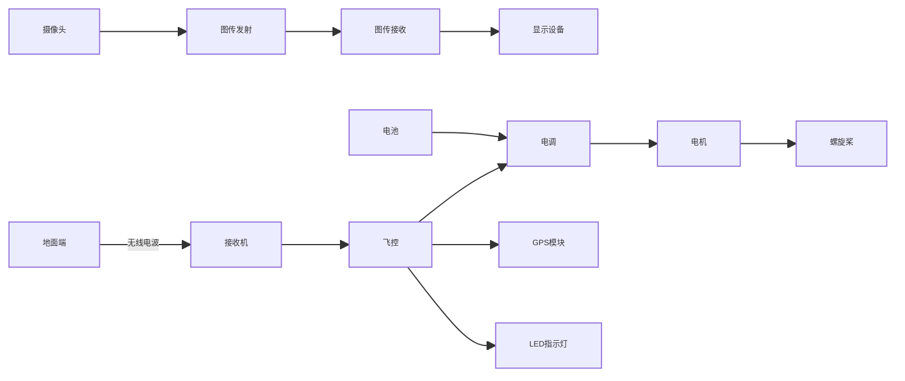
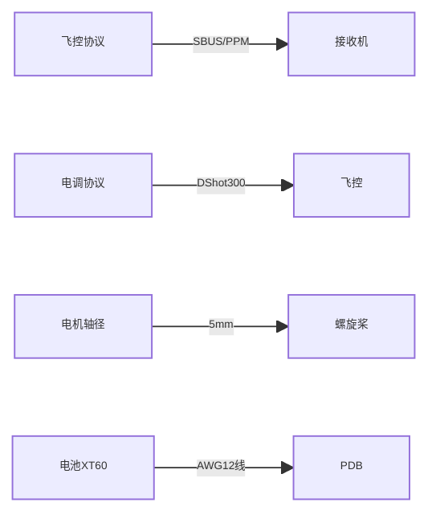

# 无人机核心组件详解

本文档将系统解析无人机七大核心组件的技术原理、选型策略与实战技巧，并提供完整的系统集成方案。

---

## 系统拓扑架构

## 无人机组件矩阵总览（深度扩展版）

| 组件名称       | 关键参数                                  | 典型型号                | 适用场景       | 兼容性要求                  | 性能指标                      | 安装难度 |
|----------------|------------------------------------------|-------------------------|----------------|---------------------------|-----------------------------|----------|
| ​**飞控**​       | MCU型号/陀螺仪/协议支持                   | Matek F722-WING        | 固定翼/垂起    | iNav固件/ PWM输出         | 32kHz刷新率 ±0.05°精度      | ★★★☆☆    |
|                | Betaflight目标板/内置黑匣子              | TBS CROSSFIRE          | 穿越机竞速     | CRSF协议/ 8S输入          | 陀螺仪采样率8kHz            | ★★☆☆☆    |
| ​**电调**​       | 持续电流/固件版本/协议                    | Hobbywing XRotor 60A   | 7寸航拍机      | DShot1200/ BLHeli32       | 128位PWM分辨率              | ★★★★☆    |
|                | 4in1集成式设计                            | T-Motor Velox 45A      | 5寸穿越机      | 支持双向DShot             | 响应时间＜10μs              | ★★☆☆☆    |
| ​**电机**​       | KV值/定子尺寸/轴承类型                    | iFlight Xing-E 2207    | 6S动力系统     | 3-6S电压/ 1700KV         | 推力＞1500g@25V            | ★★☆☆☆    |
|                | 空心杯无刷                               | T-Motor F90            | 微型无人机     | 1-2S电压/ 19000KV        | 效率＞5g/W                  | ★☆☆☆☆    |
| ​**螺旋桨**​     | 桨叶数/材质/螺距                          | HQProp DP 5x4.3x3      | 竞速穿越       | 适配5mm轴径              | 静推力1350g @15000rpm      | ★☆☆☆☆    |
|                | 折叠桨设计                               | APC 15x5.5MR           | 固定翼长航时   | 带桨夹适配器             | 效率8.2g/W @8000rpm        | ★★★☆☆    |
| ​**电池**​       | 容量/电压/C数/内阻                        | Tattu R-Line 1300mAh   | 暴力飞行       | 100C放电/ 6S             | 重量≈208g                  | ★☆☆☆☆    |
|                | 高能量密度                               | GNB 3000mAh 18650      | 长航时测绘     | 并联使用/ 低至5mΩ内阻    | 循环寿命＞500次             | ★★☆☆☆    |
| ​**图传系统**​   | 发射功率/频段/接口                        | Rush Tank Solo 1.6W    | 数字图传       | DJI协议/ 50Mbps          | 端到端延迟28ms             | ★★★☆☆    |
|                | 模拟发射器                               | TBS Unify Pro32 HV     | 模拟FPV        | 支持Pit模式/ 48CH        | 800mW RMS输出              | ★★☆☆☆    |
| ​**遥控接收机**​ | 协议类型/延迟/灵敏度                      | ExpressLRS EP1          | 远距离控制     | 868/915MHz/ 500Hz        | ＜5ms延迟 @10km            | ★★★☆☆    |
|                | 微型接收器                              | TBS Crossfire Nano      | 室内飞行       | 2.4GHz/ 150Hz           | 全向天线增益2dBi           | ★★☆☆☆    |
| ​**机架**​       | 材质/轴距/安装孔位                        | ImpulseRC Apex 5"      | 全碳纤维竞速   | 30.5x30.5/ 20x20孔位     | 整机刚度＞200N/mm          | ★★★★☆    |
|                | 折叠结构                                | DJI Flame Wheel 450    | 入门级组装     | 通用型孔位/ 450mm轴距    | 最大载荷2.5kg              | ★★☆☆☆    |
| ​**摄像头**​     | 传感器尺寸/视场角/低照度                  | RunCam Phoenix 2       | 微光环境       | 1/1.8" CMOS/ STARVIS 2  | 0.0001lux照度              | ★★☆☆☆    |
|                | 全局快门                               | CaddxFPV Polar Vista   | 高速移动       | 4:3/16:9切换            | 动态范围120dB              | ★★★☆☆    |
| ​**GPS模块**​    | 刷新率/定位精度/协议                      | BN-880Q                | 精准定位       | 10Hz刷新/ QZSS支持       | CEP＜1.5m                 | ★★★☆☆    |
|                | 双模定位                               | Here3                  | 专业测绘       | GPS+GLONASS+Galileo      | 毫米级RTK定位              | ★★★★☆    |

### 关键参数说明
1. ​**KV值**​：每伏特电压对应的空载转速（RPM/V），与螺旋桨负载特性需匹配
2. ​**C数**​：电池放电能力 = 容量(Ah) × C数，如1300mAh 100C电池最大持续电流130A
3. ​**DShot协议**​：数字通信协议版本越高延迟越低，DShot1200对应1.08μs/bit
4. ​**CEP精度**​：圆概率误差，表示50%概率的定位误差范围

### 兼容性速查

[➡️ 下一篇：机架选型指南](./frame.md)
