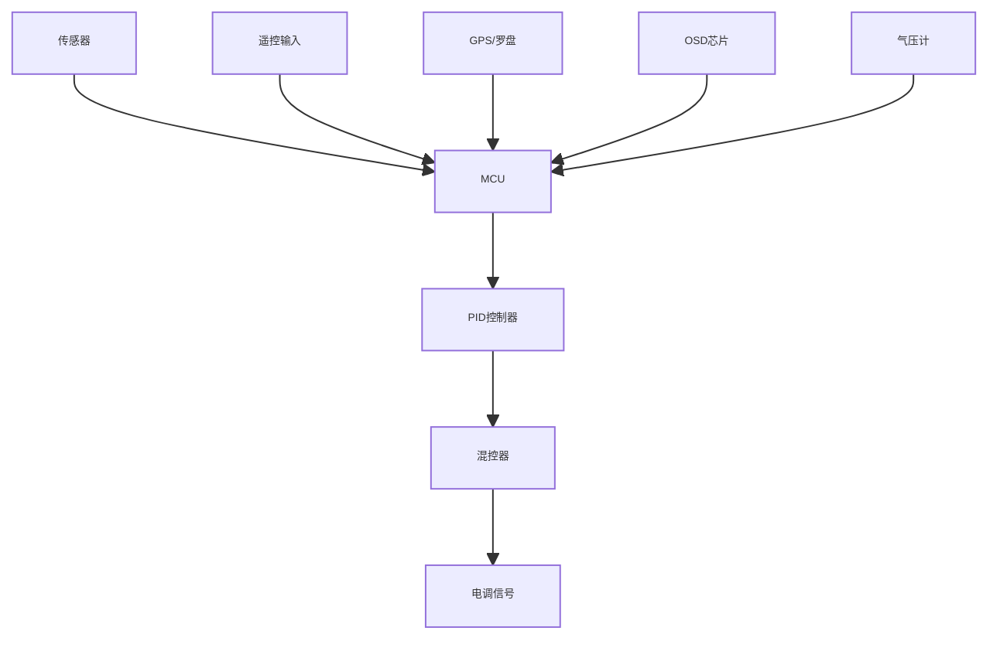
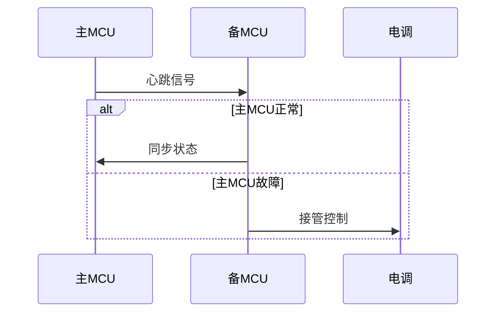
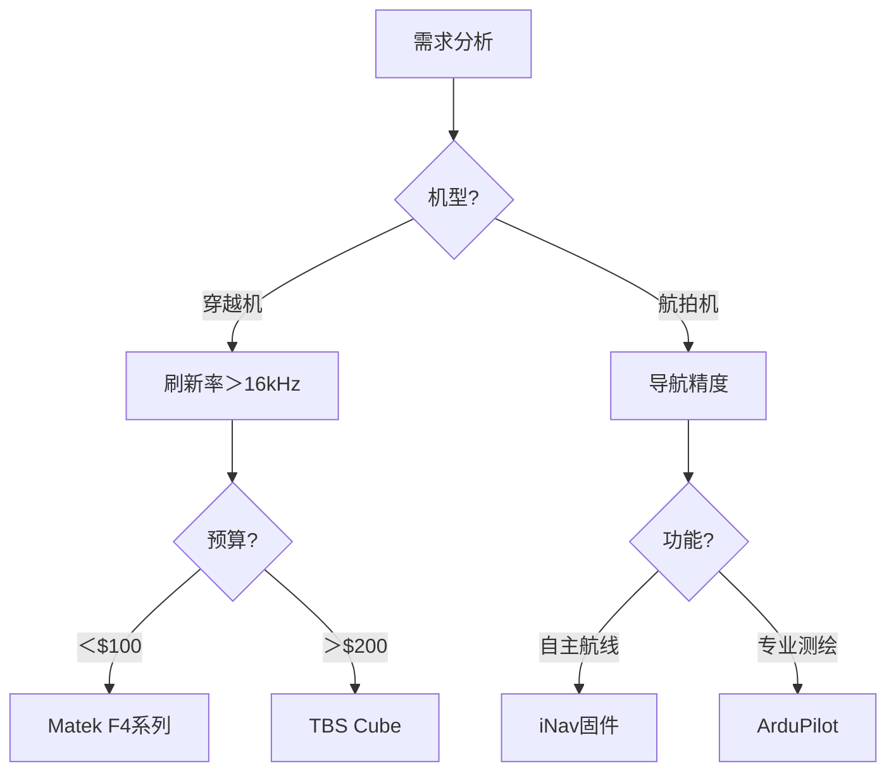

# 无人机飞控系统深度解析与技术选型指南

## 核心参数矩阵
### 主流飞控性能对比（2023 Q3）
| 型号               | 处理器    | 陀螺仪型号   | 协议支持              | 内置黑匣子 | 价格区间 |
|--------------------|-----------|-------------|----------------------|------------|----------|
| Matek F722-WING    | STM32F722 | ICM-42688-P | iNav/Betaflight      | 8MB Flash  | $80-$120 |
| TBS Cube Orange    | H743      | BMI270      | ArduPilot            | 16GB SD    | $200-$260|
| iFlight SucceX-D   | F745      | ICM-20689   | Betaflight           | 无         | $60-$90  |
| Holybro Kakute F7  | F722      | MPU6000     | Betaflight/iNav      | 2MB Flash  | $70-$100 |
| ExpressLRS FC      | H750      | BMI270      | ExpressLRS定制固件    | 无         | $45-$65  |

---

## 硬件架构剖析
### 飞控核心模块拓扑


## 固件生态分析
### 三大固件平台对比
| 特性          | Betaflight       | iNav             | ArduPilot        |
|---------------|------------------|------------------|------------------|
| 适用场景      | 穿越机/竞速      | 固定翼/垂起      | 专业测绘/物流    |
| 导航能力      | 基础GPS返航      | 全自主航线       | 厘米级RTK导航    |
| 调参复杂度    | 中               | 高               | 极高             |
| 刷新率        | 8-32kHz          | 1-4kHz           | 400Hz            |
| 典型用户      | FPV爱好者        | 航模玩家         | 工业用户         |

## 传感器技术详解
### 九轴传感器性能
| 型号        | 加速度计噪声(μg/√Hz) | 陀螺仪噪声(mdps/√Hz) | 零偏稳定性(°/h) | 工作电流(mA) |
|-------------|----------------------|----------------------|------------------|--------------|
| ICM-42688-P | 90                   | 5.8                  | 6                | 1.2          |
| BMI270      | 130                  | 8.2                  | 8                | 0.9          |
| MPU6000     | 220                  | 12.5                 | 12               | 3.9          |

### 传感器安装规范
1. 陀螺仪轴线与飞控PCB边缘偏差＜0.3°
2. 使用3M VHB胶带减震安装
3. 避免靠近电源线路（距离＞15mm）
4. 温度敏感器件需隔离热源 

## 调参实战手册
### PID调谐黄金法则
``` python
def calculate_pid(bandwidth, phase_margin):
    # 穿越机典型参数
    Kp = 0.8 * bandwidth
    Ki = 0.5 * Kp
    Kd = 0.2 * Kp
    return Kp, Ki, Kd

print(calculate_pid(120, 45))  # 输出：(96.0, 48.0, 19.2)
```

### 滤波器配置方案
| 噪声类型       | 滤波器类型   | 截止频率      | 适用场景             |
|----------------|--------------|---------------|----------------------|
| 电机噪声       | PT1          | 80-150Hz      | 高KV电机             |
| 振动噪声       | BiQuad       | 200-400Hz     | 刚性不足机架         |
| 陀螺仪噪声     | Kalman       | 动态调整      | 专业级飞控           |

## 高级功能开发
### 双冗余设计


### 故障安全策略
1. **三级故障响应​**：
- Level1：自动平衡
- Level2：GPS返航
- Level3：紧急降落

2. **电压监控策略**：
```c
if (cell_voltage < 3.3V) {
  trigger_landing();
} else if (current > 120A) {
  reduce_throttle(50%);
}
```

## 典型故障排查
### 陀螺仪异常诊断
| 现象       | 可能原因     | 解决方法               |
|------------|--------------|------------------------|
| 缓慢漂移   | 温度漂移     | 启用动态校准           |
| 高频抖动   | 共振引起     | 增加低通滤波器         |
| 突然偏转   | 电磁干扰     | 加强屏蔽/重布线路      |
| 数据溢出   | 传感器过载   | 降低刷新率             |

### 黑匣子数据分析
```python
import pandas as pd
log = pd.read_csv('blackbox.csv')
log['gyro_lpf'] = log['gyro'].rolling(window=5).mean()
plt.plot(log['time'], log['gyro_lpf'])
plt.title('陀螺仪滤波效果分析')
```

## 选型决策树


[➡️ 下一篇：接收机选型指南](./receiver.md)