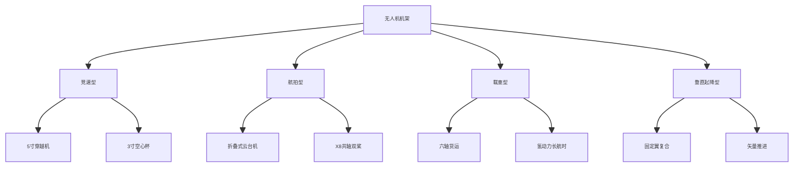
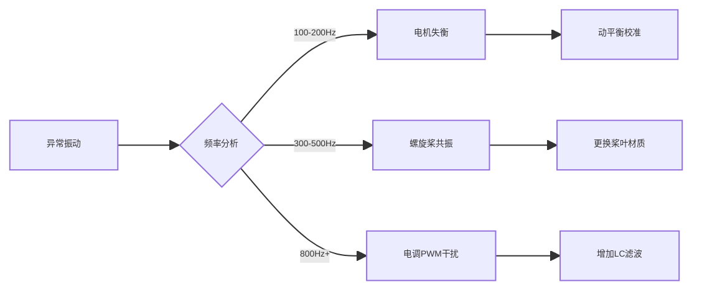
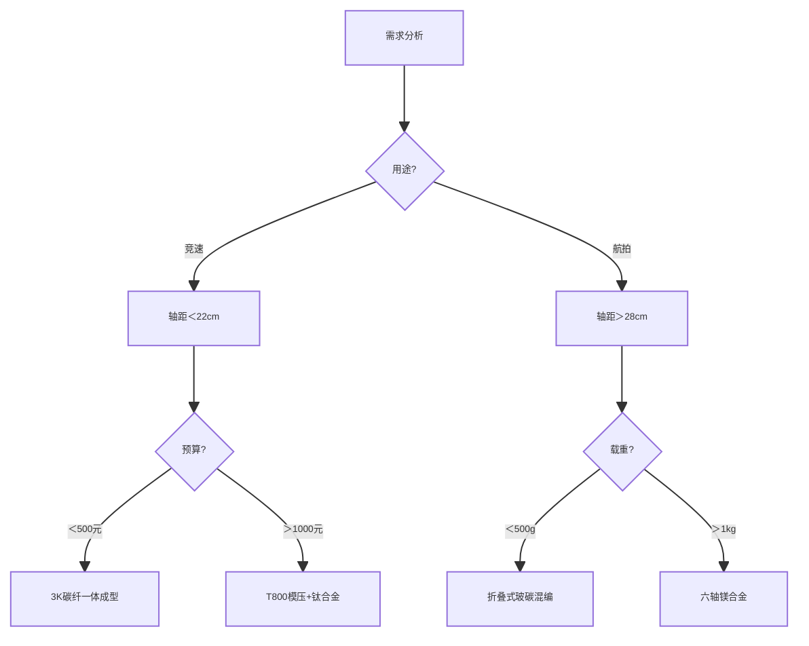

# 无人机机架设计与选型终极指南

本文将从材料工程、空气动力学、结构力学等多维度解析无人机机架的选型奥秘，提供从入门到竞赛级的完整解决方案。

---

## 机架类型全景图

### 按应用场景分类


## 性能参数对比
| 类型          | 轴距(cm) | 重量(g) | 载荷比 | 抗风等级 | 典型续航      |
|---------------|----------|---------|--------|----------|---------------|
| 3寸空心杯     | 12-15    | 80-120  | 1:0.3  | 3级      | 4-6min        |
| 5寸竞速       | 20-22    | 250-350 | 1:1.5  | 5级      | 3-5min        |
| 7寸远航       | 28-30    | 450-600 | 1:3    | 6级      | 15-25min      |
| X8航拍        | 50-60    | 1200+   | 1:5    | 4级      | 8-12min       |
| 垂起固定翼    | 150-200  | 3000+   | 1:10   | 7级      | 60-90min      |

## 材料科学深度解析
### 复合材料性能矩阵
| 材料               | 密度(g/cm³) | 抗拉强度(MPa) | 模量(GPa) | 热变形温度(℃) | 加工难度 |
|--------------------|-------------|---------------|-----------|----------------|----------|
| T700碳纤维         | 1.78        | 4900          | 230       | >200           | ★★★★☆    |
| 凯夫拉-碳纤混编    | 1.45        | 3200          | 180       | 180            | ★★★★★    |
| 6061-T6铝合金      | 2.70        | 310           | 69        | 160            | ★★☆☆☆    |
| 尼龙玻纤(3D打印)   | 1.24        | 85            | 4.5       | 120            | ★☆☆☆☆    |
| 镁合金AZ31B        | 1.77        | 260           | 45        | 130            | ★★★☆☆    |
### 材料选择黄金法则
1. **​动态载荷区​（机臂连接处）**：采用T700碳纤维+钛合金衬套
2. **​振动敏感区​（飞控安装位）**：凯夫拉复合夹层结构
3. ​**可更换结构​（起落架）**：7075铝合金阳极氧化处理
4. ​**气动优化件​（机臂整流罩）**：PA12尼龙选择性激光烧结

## 结构设计黑科技
### 机臂布局优化
#### 机臂扭转刚度计算公式
```python
def torsional_rigidity(G, J, L):
    """ 
    G: 剪切模量(GPa)
    J: 截面极惯性矩(mm⁴)
    L: 机臂长度(mm)
    """
    return (G * 1e3 * J) / L  # 单位N·m/rad
# 示例：20mm直径碳管 vs 15mm方管
print(torsional_rigidity(25, 3.14*(10**4)/2, 200))  # 圆形截面：785.5 N·m/rad
print(torsional_rigidity(25, 15**4/3, 200))        # 方形截面：843.7 N·m/rad
```

### 空气动力学优化
- **​翼型机臂​**：NACA 0012翼型降低12%风阻
- **​整流罩开孔​**：前缘30%处开泄压孔消除涡流
- **​非对称布局**​：后机臂加长5mm提升俯仰稳定性

### 减震系统设计
```markdown
[飞控] --> [硅胶柱] --> [碳板]
         │
         └─ [VISCO弹性体] --> [铝蜂窝芯]
```

## 装机实战手册
### 五步安装法
1. **骨架校准**
- 使用光学水平仪调整机臂平面度＜0.1°
- 对角线长度误差＜0.5mm
2. **动力系统集成**
``` c
// 电机安装角度补偿
float motor_angle = atan2(arm_length, COG_height); 
// 通常设置2-5°外倾角
```

3. **减震系统调校**
- 硅胶柱硬度：飞控重量(g) × 0.8 = 邵氏硬度A
- 谐振频率避开电机工作频率(100-400Hz)
4. **布线规范**
- 电源线与信号线夹角＞60°
- 同向线缆每10cm使用一个扎带节点
5. **动平衡测试**
- 悬吊测试法检测重心偏移
- 配重公式：m = (ΔL × M) / (2D)
（ΔL：偏移量，M：总质量，D：轴距）

## 故障排查宝典
### 振动问题分析


### 战损应急方案
1. ​**碳纤维断裂​**：碳布+AB胶临时修补（强度恢复70%）
2. ​**螺纹滑牙​**：插入铜衬套重新攻丝 ​
3. **减震失效​**：临时改用3M VHB双面胶固定

## 机型决策树


[➡️ 下一篇：飞控选型指南](hardware/fc.md)