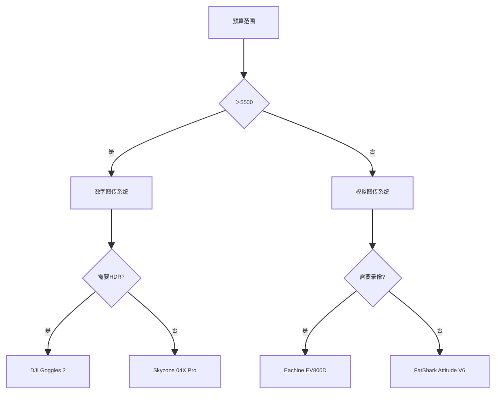

# FPV飞行眼镜深度解析与技术选型指南

## 核心参数矩阵（2023 Q3）
### 主流FPV眼镜性能对比
| 型号                | 显示技术     | 分辨率    | FOV(°) | 接收模块       | 输入接口      | 重量(g) | 续航(h) |
|---------------------|-------------|----------|--------|---------------|---------------|--------|--------|
| DJI Goggles 2       | Micro-OLED  | 1920×1080| 54     | O3 Air Unit   | HDMI/USB-C    | 390    | 2.5    |
| FatShark HDO2       | OLED        | 1280×960 | 50     | RapidFire     | AV/HDMI       | 320    | 3.0    |
| Skyzone 04X Pro     | OLED        | 1280×720 | 46     | SteadyView IV | AV/HDMI/USB   | 360    | 2.8    |
| Orqa FPV.One        | Micro-OLED  | 1920×1080| 58     | Pro58         | HDMI/DP       | 410    | 2.2    |
| Eachine EV800D      | LCD         | 1280×720 | 40     | 40CH          | AV            | 480    | 1.5    |

---

## 光学系统核心技术
### 显示参数公式
$$ PPD = \frac{\sqrt{H_{res}^2 + V_{res}^2}}{FOV_{diag}} } $$
- PPD：角分辨率（像素/度）
- H/V_res：水平/垂直分辨率
- FOV_diag：对角线视场角

### 光学路径设计


--- 
## 硬件架构解析
### 数字图传处理流程
```c
struct VideoPipeline {
    uint32_t input_res;   // 输入分辨率
    uint8_t  color_depth; // 色深(bit)
    float    latency;     // 处理延迟(ms)
    bool     hdr;         // 高动态范围
    uint16_t fov;         // 视场角(x10)
};
```

### 核心组件参数
| 组件       | 技术指标               | 典型方案                     |
|------------|------------------------|------------------------------|
| 显示屏     | 刷新率: 90-120Hz       | Samsung AMOLED               |
| 透镜组     | 屈光度调节: ±5D        | 非球面树脂镜片               |
| 接收模块   | 灵敏度: -98dBm         | Realtek RTL2832U             |
| 电池系统   | 快充协议: PD3.0        | 双18650 7.4V 5000mAh         |

--- 
## 视觉优化技术
### 显示增强算法
1. ​动态锐化​：CLAHE算法增强边缘
2. ​噪声抑制​：时域空域联合降噪​
3. 低延迟模式​：旁路图像处理单元
4. ​色彩管理​：DCI-P3色域映射

### 瞳距自适应系统
```python
def adjust_ipd(ipd):
    lens_distance = ipd * 0.8 + 56  # 毫米单位
    return clamp(lens_distance, 58, 72)

print(f"镜片间距: {adjust_ipd(63)}mm")  # 输出：镜片间距: 66.4mm
```

--- 
## 人体工学设计
### 佩戴舒适度要素
| 参数         | 竞赛级标准 | 航拍级标准 |
|--------------|------------|------------|
| 面罩贴合压力 | ＜120g/cm² | ＜80g/cm²  |
| 鼻托接触面积 | ＞200mm²   | ＞300mm²   |
| 散热气流     | 12L/min    | 8L/min     |
| 重心偏移     | ＜5mm      | ＜10mm     |

### 通风系统设计
```markdown
[进气口] --> [离心风扇] --> [导流腔] 
                    --> [显示屏散热片]
                    --> [面罩排气孔]
```

--- 
## 信号优化方案
### 多频段接收策略
| 频段     | 天线类型   | 适用场景       |  
|----------|------------|----------------|  
| 5.8GHz   | 螺旋极化   | 竞速/花飞      |  
| 2.4GHz   | 平板定向   | 远距离         |  
| 1.3GHz   | 四叶草     | 绕障穿透       |  

### 世界冠军配置
- **眼镜**​：DJI Goggles 2（改装版）
- **天线​** | MenaceRC Patch + TrueRC X-Air
- **接收器​** | TBS Fusion
- **延迟​** | 28ms（端到端）
- **续航**​ | 外接18650电池组（6h）

## 选型决策树


``​专家建议​：竞速玩家首选＜30ms延迟+宽FOV组合，影视航拍推荐HDR+高分辨率方案``

[➡️ 下一篇：遥控器选择](./rc.md)