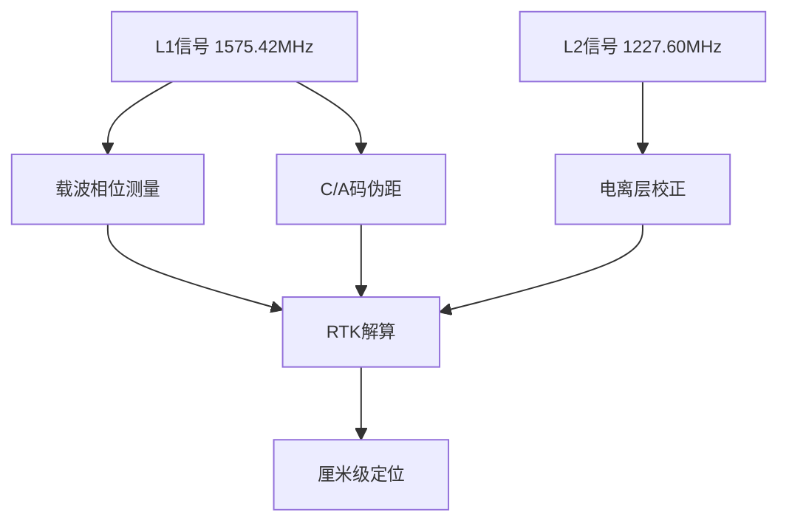
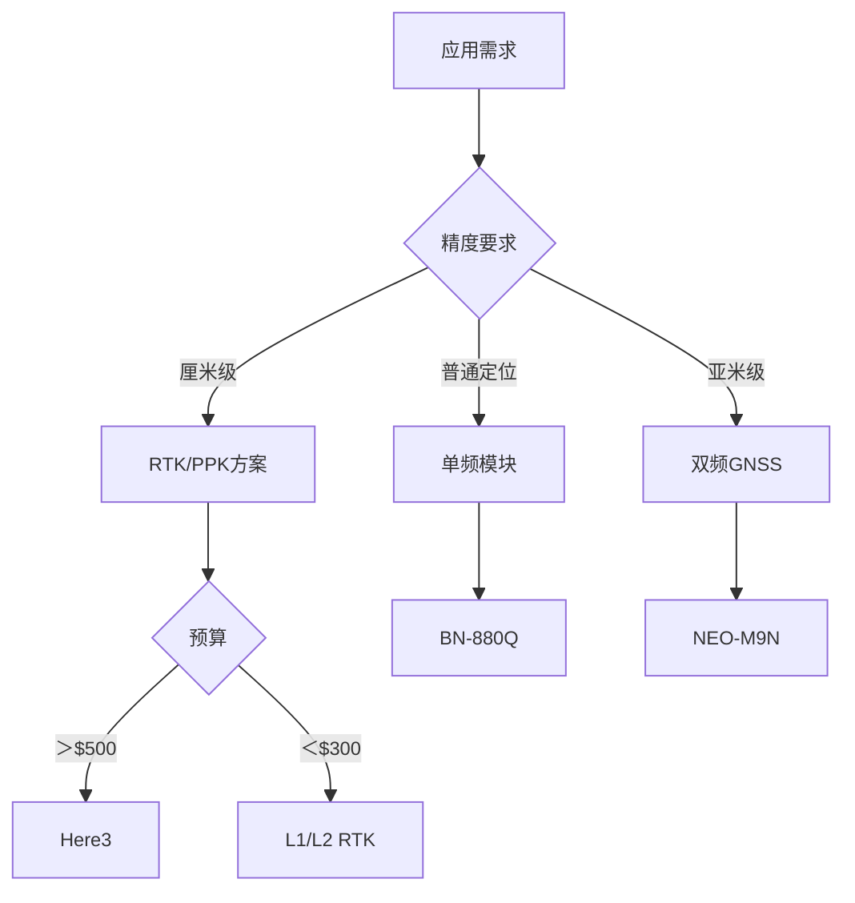

# 无人机GPS模块选型与高精度定位技术指南

## 核心参数矩阵（2023 Q3）
### 主流GPS模块性能对比
| 型号               | 芯片方案       | 定位精度   | 刷新率(Hz) | 协议支持       | 功耗(mW) | 冷启动时间(s) |
|--------------------|---------------|------------|------------|----------------|----------|---------------|
| BN-880Q           | UBX-M8030     | 1.5m CEP   | 10         | GPS+GLONASS    | 120      | 29            |
| Here3             | ZED-F9P       | 10cm RTK   | 20         | 全星座+双频     | 350      | 34            |
| M8N               | UBX-M8N       | 2.5m CEP   | 5          | GPS+BeiDou     | 95       | 25            |
| NEO-M9N           | UBX-M9N       | 1.0m CEP   | 18         | 全星座         | 180      | 32            |
| L1/L2 RTK         | AT6558        | 1cm PPK    | 25         | GPS+GALILEO    | 420      | 45            |

---

## 定位技术深度解析
### 多频段信号处理


--- 
## 硬件架构解析
### 双频接收机拓扑
```c
struct RTK_GPS {
    uint8_t  antenna_type;    // 螺旋/微带
    uint16_t update_rate;     // Hz
    float    baseline_length; // 基线长度(m)
    bool     moving_base;     // 移动站模式
    uint32_t solution_age;    // 数据时效(ms)
};
```

### 抗干扰技术方案
| 技术       | 实现方式               | 改善效果             |  
|------------|------------------------|----------------------|  
| 波束成形   | 四元螺旋天线阵列       | +15dB抑制            |  
| 自适应滤波 | LMS算法实时调整        | 消除窄带干扰         |  
| 频率捷变   | 动态切换L1/L2频段      | 规避干扰源           |  

--- 
## 安装规范手册
### 黄金安装法则
1. 位置选择​：
    - 远离电机＞15cm
    - 高于机架平面＞3cm
    - 远离碳纤维结构
2. 天线方向​：
    - 全向天线竖直安装
    - 定向天线前向±15°
    - 屏蔽层可靠接地
3. 电磁隔离​：
    - 磁罗盘距离＞5cm
    - 电源线加装铁氧体磁环
    - 使用双绞屏蔽线（AWG24）

### 固件升级流程
```python
def update_gps_firmware(module):
    assert check_battery() >= 3.7, "电压不足"
    enter_bootloader()
    erase_flash()
    write_new_firmware("v2.18.hex")
    if verify_checksum():
        reboot()
    else:
        rollback()
```

---
## 故障排查宝典
### 定位异常诊断
| 现象       | 可能原因       | 解决方案         |  
|------------|----------------|------------------|  
| 水平漂移   | 多路径效应     | 加装地平面       |  
| 冷启动超时 | 星历过期       | 更新AGPS数据     |  
| 高度跳变   | 电离层扰动     | 启用双频修正     |  
| 卫星数骤降 | 天线损坏       | 测试VSWR＜1.5    |  

### 信号质量检测
```python
import numpy as np

snr = [45, 38, 42, 28, 33]  # 各卫星信噪比
print(f"平均信噪比: {np.mean(snr):.1f} dBHz")
print(f"有效卫星数: {sum(s > 30 for s in snr)}/{}")
plt.bar(range(len(snr)), snr)
plt.title("卫星信噪比分布")
```

--- 
## 高精度定位方案
### RTK系统配置


### 性能提升措施
1. 基线优化​：
    - 基准站间距＜20km
    - 使用扼流圈天线
2. 数据时效控制​：
    - 数传延迟＜200ms
    - 数据更新率≥5Hz

---
## 选型决策树


### 专家建议：
- 测绘任务：双频RTK + 地面基站
- 竞速机型：M9N高刷新率配置
- 长航时FPV：BN-880Q低功耗方案