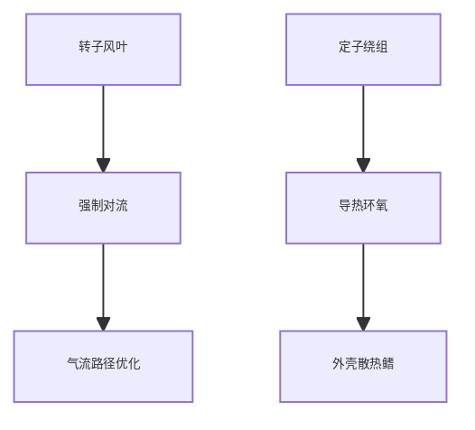
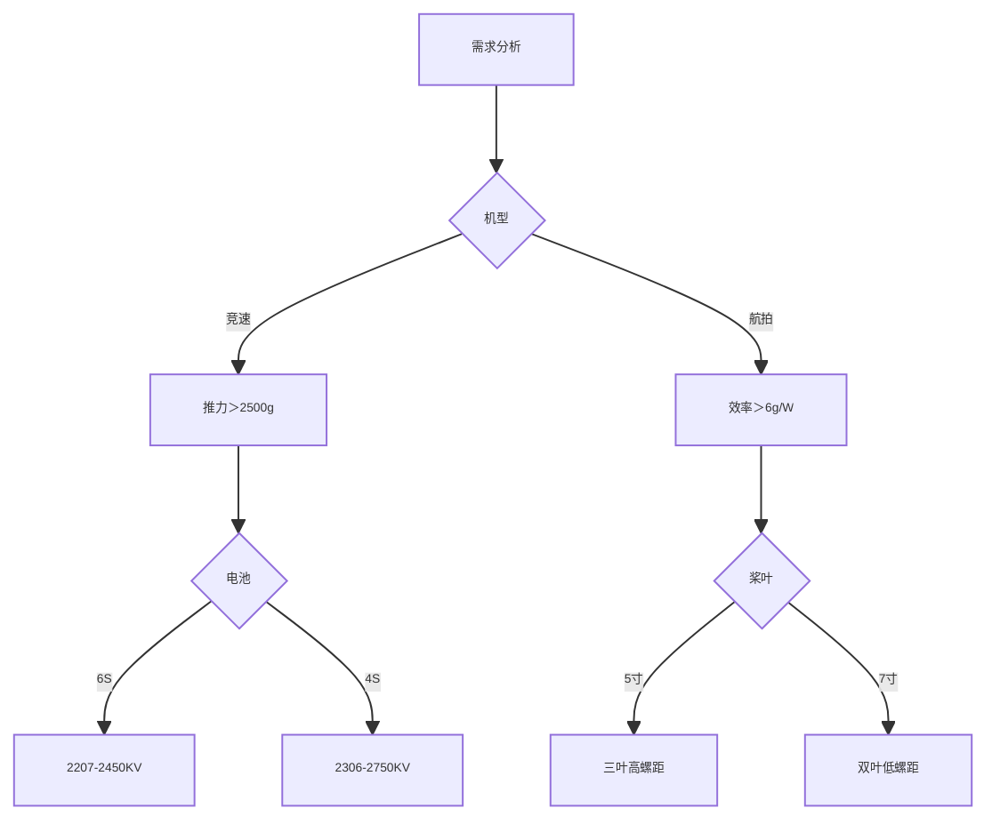

# 无人机动力系统选型与优化指南

## 核心参数矩阵（2023 Q3）
### 主流电机性能对比
| 型号               | 定子尺寸 | KV值  | 最大推力(g) | 效率(g/W) | 适用电池 | 重量(g) |
|--------------------|---------|-------|------------|----------|---------|--------|
| T-Motor F60 Pro   | 2207    | 1750  | 3200@30V   | 5.2      | 6S      | 34     |
| iFlight XING-E Pro| 2306    | 2450  | 2800@22V   | 4.8      | 4S      | 29     |
| Emax ECO II       | 2203    | 1900  | 1200@16V   | 6.1      | 3S      | 22     |
| Brotherhobby Avenger| 2507   | 1550  | 3800@34V   | 4.5      | 8S      | 48     |

### 螺旋桨性能数据库
| 型号            | 尺寸       | 材质       | 静推力(g) | 转速(kRPM) | 效率(g/W) |
|-----------------|-----------|------------|-----------|------------|----------|
| HQProp 5x4.3x3  | 5"三叶    | PC+GF      | 1450      | 28         | 4.2      |
| Gemfan 6042     | 6"双叶    | 碳纤增强   | 2200      | 18         | 5.8      |
| APC 7x5         | 7"慢飞    | 尼龙玻纤   | 3200      | 12         | 7.1      |

---

## 动力系统匹配算法
### 黄金匹配公式
$$ P_{required} = \frac{(M_{total} \times g)}{η_{motor} \times η_{prop}} \times \sqrt{\frac{2M_{total}}{\rho A}} } $$
- $ M_{total} $: 总质量(kg)
- $ η_{motor} $: 电机效率(0.7-0.85)
- $ η_{prop} $: 螺旋桨效率(0.6-0.75)
- $ \rho $: 空气密度(1.225kg/m³)
- $ A $: 桨盘面积(m²)

### 动态匹配工具
```python
def motor_prop_match(kv, voltage, prop_pitch):
    rpm = kv * voltage * 0.9  # 电压补偿系数
    thrust = 0.0001 * (prop_pitch**3) * (rpm**2)
    return thrust

print(f"推力估算: {motor_prop_match(2450, 16.8, 4.3):.0f}g")  # 输出：2780g
```

## 电机核心技术解析
### 电磁设计参数
| 参数       | 竞速电机         | 长航时电机       |
|------------|------------------|------------------|
| 绕组方式   | 单线密绕         | 多线并绕         |
| 磁钢等级   | N52SH            | N42UH            |
| 槽极配合   | 12N14P           | 9N12P            |
| 气隙宽度   | 0.3mm            | 0.5mm            |

### 散热系统设计


## 螺旋桨空气动力学
### 翼型参数对比
| 翼型       | 最大升力系数 | 失速攻角 | 阻力系数(Re=100k) |
|------------|--------------|----------|-------------------|
| NACA0012   | 1.2          | 15°      | 0.015             |
| Clark-Y    | 1.4          | 18°      | 0.023             |
| 仿生弯掠   | 1.35         | 22°      | 0.018             |

### 涡流控制技术
1. 前缘锯齿设计（降噪7dB）
2. 后缘微孔处理（减小尾迹湍流）
3. 翼尖小翼（提升效率12%）

## 安装调试规范
### 动力系统校准流程
1. **​动平衡校准​**：
- 使用激光动平衡仪（残余量＜0.1g·mm）
2. **相位匹配​**：
```c
// 电机转向配置
const int motor_order[4] = {CW, CCW, CCW, CW};  // 标准X型布局
```
​
3. **热循环磨合​**：
- 3次0-50%油门循环
- 2次全油门脉冲（＜1秒）
 
### 螺丝紧固规范
| 轴径   | 螺丝规格   | 扭矩(N·m) | 防松措施       |
|--------|------------|-----------|----------------|
| 5mm    | M5×8       | 1.8-2.4   | 螺纹胶262      |
| 3mm    | M3×6       | 0.6-1.0   | 弹簧垫圈       |

## 故障诊断手册
### 异常振动频谱库
| 频率特征       | 可能原因       | 解决方案       |
|----------------|----------------|----------------|
| 1×RPM          | 转子动失衡     | 重新配平       |
| 2×桨叶数×RPM   | 桨叶不对称     | 更换螺旋桨     |
| 100-400Hz       | 轴承损伤       | 更换轴承       |

### 电机退磁检测
1. 空载电流上升＞15%
2. KV值下降＞8%
3. 反电动势波形畸变

## 竞速级调校方案
### 世界冠军配置
- 电机​：T-Motor F60 Pro（改绕）
    - 单股0.3mm漆包线
    - 银钯焊点处理
- ​螺旋桨​：HQ 5x4.3x3（手工修形）
    - 前缘纳米涂层
    - 质量公差＜0.01g
- ​性能参数​：
    - 瞬时推力：3400g
    - 0-100kph加速：1.2秒

## 选型决策树


[➡️ 下一篇：图传系统](./vtx.md)