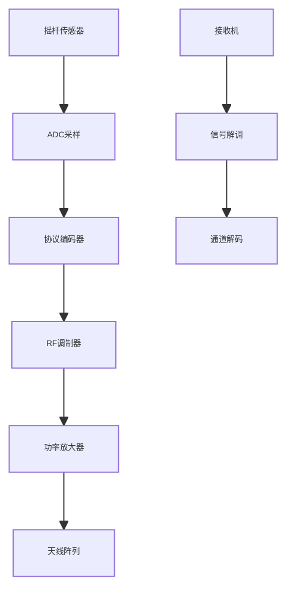
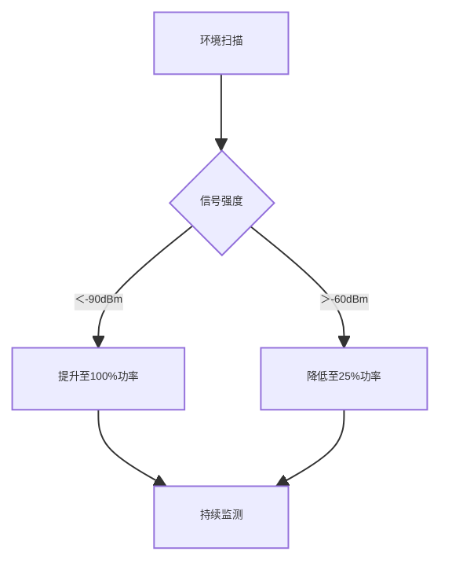
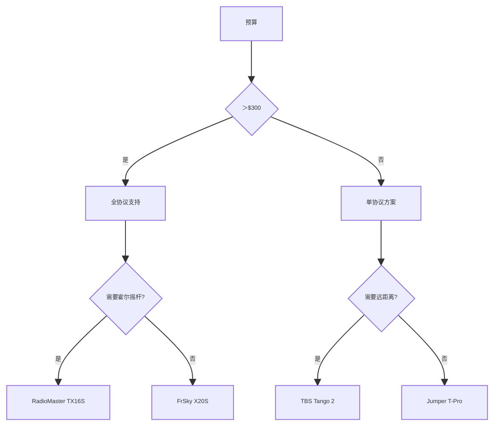

# 无人机遥控器技术选型与深度解析

## 核心参数矩阵（2023 Q3）
### 主流遥控器性能对比
| 型号                | 协议类型      | 通道数 | 延迟(ms) | RF功率(mW) | 续航(h) | 重量(g) | 霍尔摇杆 |
|---------------------|-------------|-------|---------|------------|--------|--------|--------|
| RadioMaster TX16S   | CRSF/ELRS   | 16    | 4.5     | 1000       | 12     | 750    | ✓      |
| TBS Tango 2 Pro     | Crossfire   | 12    | 3.8     | 2000       | 8      | 520    | ✓      |
| FrSky X20S          | ACCESS      | 24    | 6.2     | 250        | 15     | 920    | ✗      |
| Flysky PL18         | AFHDS 3     | 18    | 9.5     | 500        | 20     | 680    | ✗      |
| Jumper T-Pro        | Multi       | 16    | 5.1     | 350        | 10     | 420    | ✓      |

---

## 射频系统架构
### 信号传输拓扑


## CRSF协议帧结构
```c
// CRSF协议帧示例
struct CrsfFrame {
    uint8_t device_addr;
    uint8_t frame_size;
    uint8_t type;
    uint16_t channels[16]; // 11bit分辨率
    uint8_t crc;
};
```

--- 

## 核心技术解析
### 摇杆传感技术
| 类型       | 分辨率(bit) | 寿命(万次) | 温漂(‰/℃) | 典型型号       |  
|------------|-------------|------------|------------|----------------|  
| 电位器     | 10          | 50         | 2.5        | ALPS RKJXT1F   |  
| 霍尔效应   | 14          | 1000+      | 0.3        | TLE5010B       |  
| 磁编码器   | 16          | 无限       | 0.1        | AS5600         |  

--- 

## 硬件架构设计
### 主控系统组成
```c
struct RadioHardware {
    uint32_t mcu_freq;      // STM32H743 480MHz
    uint8_t  adc_res;       // 16bit ADC
    uint16_t rf_chip;       // SX1280/SX1276
    bool     diversity;     // 双天线分集
    float    battery;       // 2S 18650
};
```
### 天线优化方案
| 天线类型   | 增益(dBi) | 波束宽度 | 适用场景       |  
|------------|-----------|----------|----------------|  
| 全向鞭状   | 2.15      | 360°     | 近距离花飞     |  
| 平板定向   | 8.5       | 60°      | 远距离FPV      |  
| 螺旋极化   | 5.2       | 120°     | 绕障竞速       |  

--- 

## 调试与校准规范
### 摇杆校准流程
1. **机械校准​**：
    - 拆除弹簧组件
    - 使用0.01mm级千分尺测量中点位置    
2. **软件校准​**：
```python
def calibrate_stick(raw_min, raw_max):
    midpoint = (raw_max + raw_min) // 2
    scale = 1000.0 / (raw_max - midpoint)
    return midpoint, scale
```

3. **​动态测试​**：
    - 绘制Lissajous图形验证线性度

### 功率调整策略


--- 

## 故障排查手册
### 信号问题诊断
| 现象       | 可能原因       | 解决方案         |  
|------------|----------------|------------------|  
| 间歇性断联 | 天线接触不良   | 更换SMA连接器    |  
| 控制延迟   | 协议版本不匹配 | 刷新固件         |  
| 通道串扰   | 电源纹波过大   | 加装LC滤波器     |  

### RF频谱分析
```python
import matplotlib.pyplot as plt

freq = [2.4, 5.8, 900]  # GHz
noise = [-85, -92, -78]
plt.plot(freq, noise)
plt.title("频段干扰分析")
plt.xlabel("Frequency (GHz)")
plt.ylabel("Noise Floor (dBm)")
```

--- 

## 竞赛级优化方案
### 世界冠军配置
- 遥控器​：TBS Tango 2（改装版）
    - 升级SX1280高频头
    - 陶瓷天线阵列
    - 钛合金霍尔摇杆
- ​性能参数​：
    - 延迟：3.2ms
    - 有效距离：15km
    - 摇杆分辨率：0.05°


## 选型决策树


[➡️ 下一篇：电池选择](./battery.md)