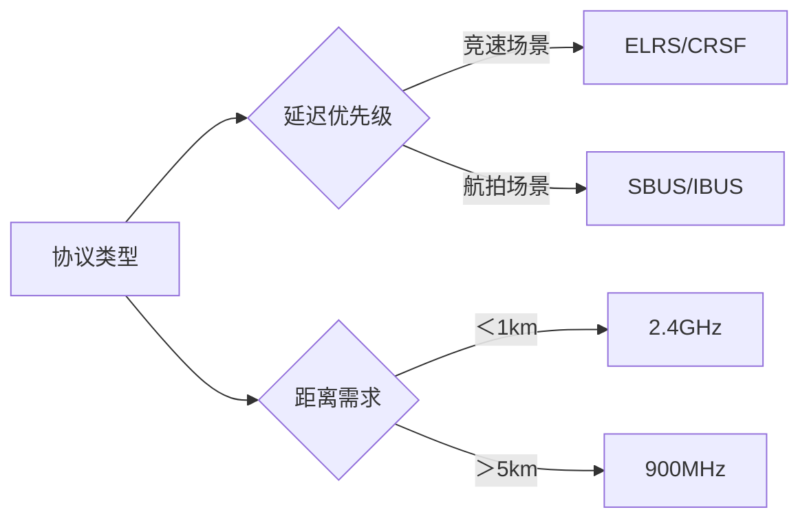
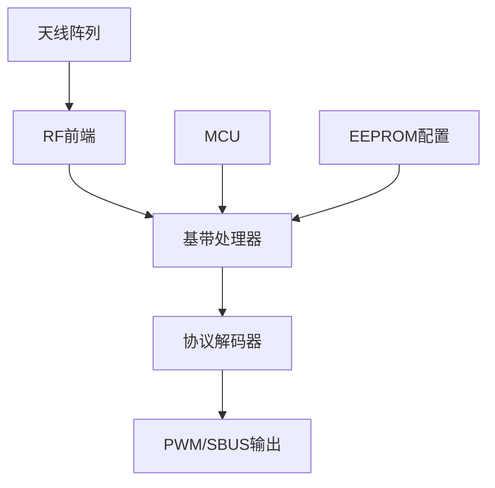
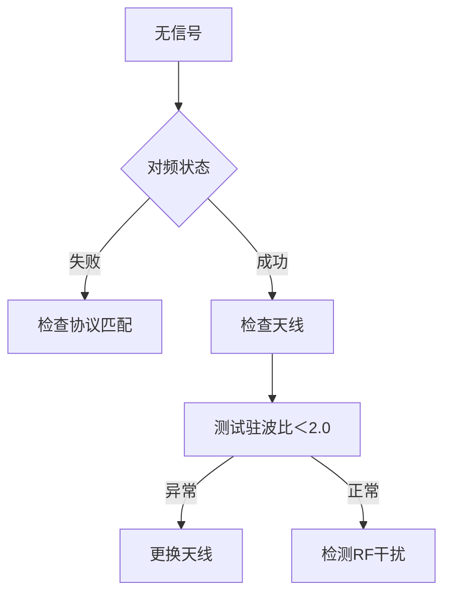
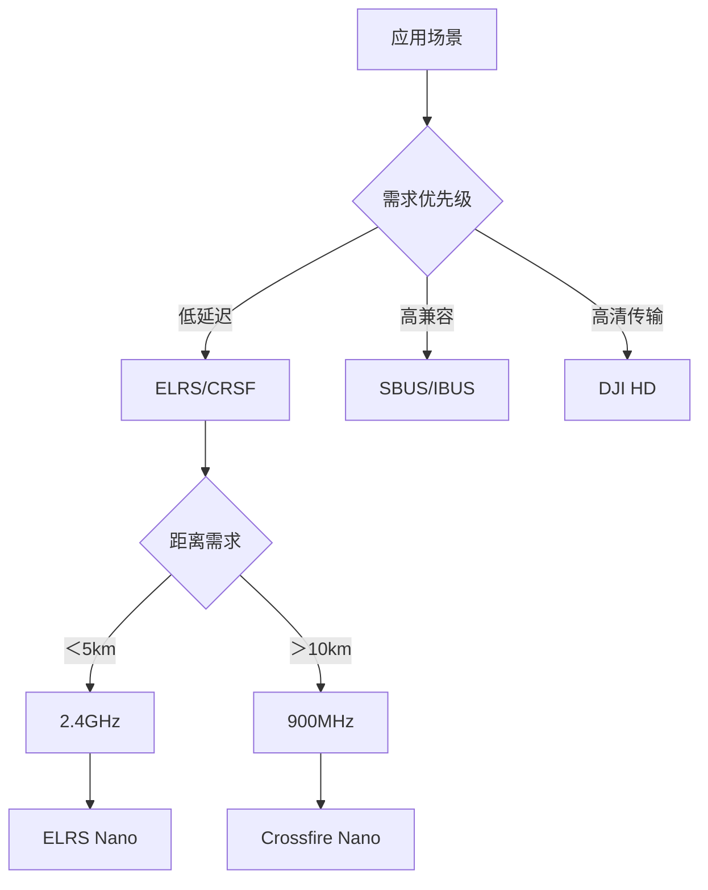

# 无人机接收机选型与技术解析

## 核心参数矩阵（2023 Q3）
### 主流接收机性能对比
| 型号                | 协议类型      | 延迟(ms) | 灵敏度(dBm) | 功耗(mW) | 有效距离(km) | 天线配置     |
|---------------------|-------------|---------|------------|---------|-------------|-------------|
| TBS Crossfire Nano  | CRSF        | 4       | -112       | 200     | 10+         | 双极化天线   |
| ExpressLRS EP1      | ELRS 2.0    | 1.5     | -108       | 150     | 8           | 陶瓷天线     |
| FrSky R-XSR         | ACCST D16   | 9       | -102       | 100     | 2           | PCB天线     |
| Flysky FS-A8S       | AFHDS 2A    | 12      | -97        | 80      | 0.8         | 软鞭天线     |
| DJI O3 Air Unit     | DJI HD      | 28      | -105       | 500     | 4           | 全向阵列    |

---

## 通信协议深度解析
### 协议性能指标


### 协议技术参数
| 参数          | SBUS         | CRSF         | ELRS         | DJI HD       |
|---------------|--------------|--------------|--------------|--------------|
| 通道数        | 16           | 16           | 12           | 16           |
| 波特率(bps)   | 100000       | 420000       | 1000000      | 2000000      |
| 数据包频率(Hz)| 333          | 150-500      | 1000         | 50           |
| 容错机制      | 奇偶校验     | CRC32        | LDPC编码     | 前向纠错     |

## 硬件架构剖析
### 接收机电路拓扑


### 灵敏度增强技术
1. ​LNA设计​：使用NXP BFU730F低噪声放大器（NF=0.8dB）
​2. 分集接收​：双天线相位合成技术
​3. 自适应滤波​：Kalman滤波消除多径干扰
​4. 功率控制​：动态调整发射功率（0-100mW）

## 安装与调试规范
### 天线部署黄金法则
1. ​极化匹配​：接收机与遥控器天线同极化方向（垂直/水平）​
2. 空间分集​：双天线呈90°夹角布置
3. 避障原则​：
    - 远离碳纤维结构＞5cm
    - 与电机线距离＞10cm
    - 避免与图传天线平行

### 信号强度测试代码
```python
import numpy as np

def rssi_to_percent(rssi, max_rssi=-40, min_rssi=-120):
    return np.clip((rssi - min_rssi)/(max_rssi - min_rssi)*100, 0, 100)

print(f"信号强度: {rssi_to_percent(-85)}%")  # 输出：信号强度: 54.5%
```
## 故障排查手册
### 典型故障树


### 干扰源数据库
| 频率     | 常见干扰源         | 解决方案                     |
|----------|--------------------|------------------------------|
| 2.4GHz   | WiFi路由器/微波炉  | 切换至CH8-11                 |
| 5.8GHz   | 数字图传/DJI设备   | 使用CH1-4低干扰频段          |
| 900MHz   | 4G基站/物联网设备  | 申请当地无线电许可           |

## 竞速级优化方案
### ELRS超低延迟配置
1. **参数调优​**：
```ini
# ExpressLRS 配置
rate = 500Hz
switch_delay = 0
telem_ratio = 1:128
```
2. **硬件改造​**：
- 移除LED指示灯电路
- 改用0402封装元件
- 添加EMI屏蔽罩

### 世界冠军配置
- 接收机​：ELRS EP1（改装版）
- ​天线​：Moxon定向天线（增益5dBi）
- 延迟​：1.2ms（端到端）
- ​刷新率​：1000Hz

### 选型决策树


[➡️ 下一篇：眼镜选择](./glasses.md)