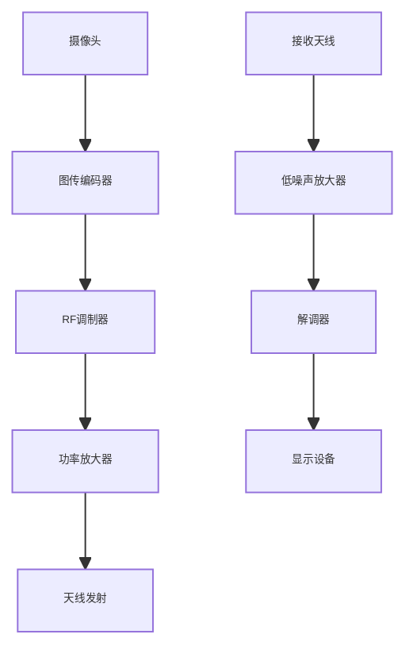
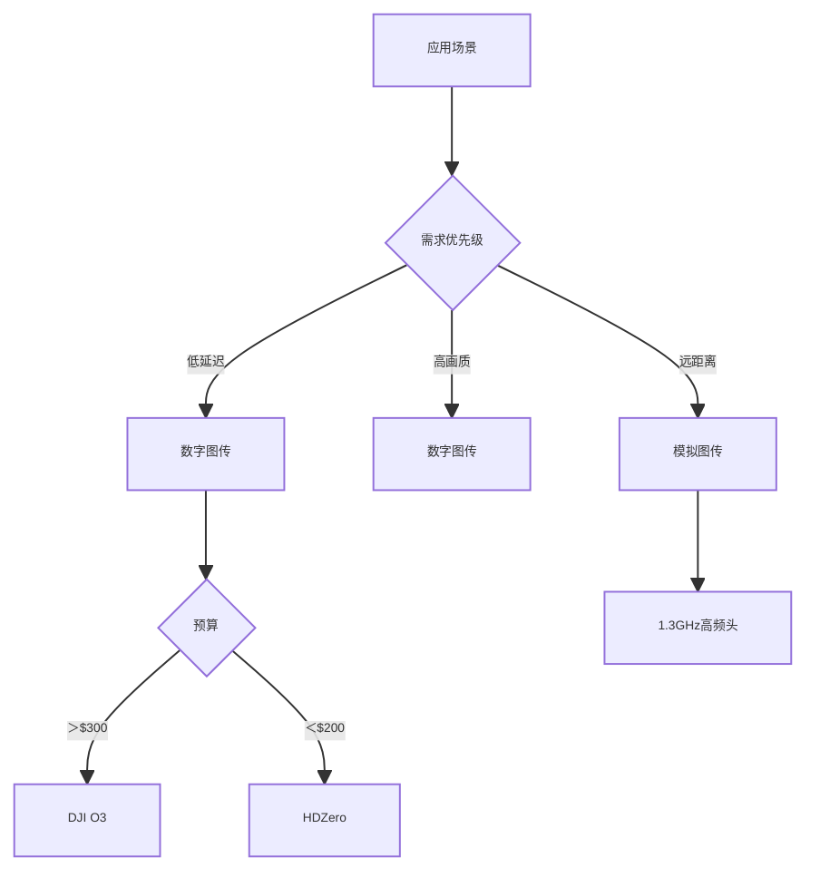

# 无人机图传系统深度解析与技术选型指南

## 核心参数矩阵（2023 Q3）
### 主流图传系统性能对比
| 型号               | 类型      | 分辨率   | 延迟(ms) | 发射功率(mW) | 频段       | 功耗(W) |
|--------------------|-----------|---------|---------|-------------|------------|--------|
| DJI O3 Air Unit    | 数字      | 1080p60 | 28      | 1200        | 5.8GHz     | 9.5    |
| TBS Fusion         | 模拟      | 800TVL  | 17      | 2000        | 5.8GHz     | 3.2    |
| HDZero Race        | 数字      | 720p90  | 14      | 350         | 5.8GHz     | 4.8    |
| Rush Tank Ultimate | 模拟      | 1200TVL | 22      | 800         | 5.8/2.4GHz | 2.7    |
| Walksnail Avatar   | 数字      | 1080p30 | 33      | 1000        | 5.8GHz     | 7.1    |

---

## 信号传输原理
### 视频链路拓扑


--- 

## 硬件架构解析
### 数字图传核心模块
```c
struct DigitalVTX {
    uint16_t resolution;  // 分辨率
    uint8_t framerate;    // 帧率
    uint32_t bitrate;     // 编码码率
    uint16_t tx_power;    // 发射功率
    float frequency;      // 工作频率
};
```

### 模拟图传性能优化
1. 信号增强技术​：
    - 预加重电路（提升高频分量）
    - 自动增益控制（AGC）
    - 噪声抑制滤波器

2. 功率放大器设计​：
    - 使用GaN射频器件（效率＞65%）
    - 动态功率调整（25-2000mW）
    - 温度补偿电路

--- 

## 频段与信道管理
### 5.8GHz信道分布

### 多设备共存方案
```python
def channel_selector(env_type):
    if env_type == "race":
        return ["R1", "R4", "R8"][np.argmin(scan_noise())]
    elif env_type == "long_range":
        return "E2"  # 1.3GHz低频段
    else:
        return auto_search()

print(channel_selector("race"))  # 自动选择最低干扰信道
```

## 选型决策树


``​专家建议​：竞速场景首选HDZero/WS+高频头方案，影视航拍推荐DJI O3双天线系统``

[➡️ 下一篇：电机与螺旋桨选择](./motors.md)